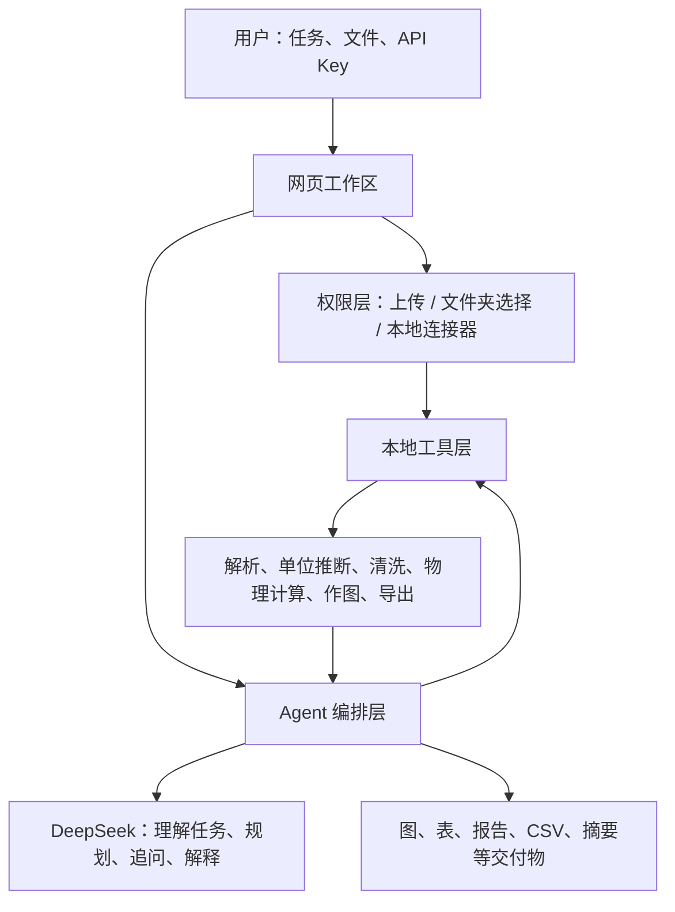
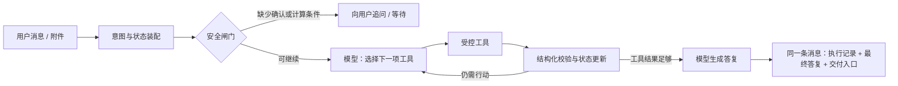

# Spectra Copilot Agent 架构

> 状态：v0.3。本仓库同时支持本地桌面模式与公共上传演示模式。本文会明确区分当前已实现行为与后续生产化规划；“下一阶段”等表述均不是当前已实现功能。

## 目标

用户用自然语言交代研究任务，Agent 在用户授权范围内取得数据、识别数据含义、提出必要追问、调用确定性光谱工具，并按任务生成图、表、报告、数据文件或实验摘要。

## 不能混淆的两种文件入口

| 场景 | 用户如何授权 | Agent 能读什么 |
| --- | --- | --- |
| 公共上传演示模式（已实现） | 在浏览器中上传一个或多个文件 | 仅本轮主动上传的文件；内存中最多保留两小时 |
| 本地桌面模式（已实现） | 启动本地服务 | 当前用户 Desktop 范围内的支持文件，或浏览器上传的文件 |
| 完整桌面连接器（规划） | 安装桌面程序后，在系统权限窗口选择目录 | 仅用户授予的目录，例如 Desktop/实验数据 |

普通网页不能像 Codex 那样扫描访问者整台电脑。公共演示版通过 `SPECTRA_MODE=public` 强制关闭 Desktop 扫描，只接受上传文件；生成图表与报告也只保存在运行内存。需要 Codex 式目录检索体验时，仍应配合用户安装的本地连接器。连接器只监听 `localhost`，每次扩大目录范围都由用户确认。

本地模式固定监听 `127.0.0.1`，桌面搜索默认范围为当前用户的 `Desktop` 目录；公共模式监听托管平台提供的端口，仅允许显式上传，不能沿用本地默认范围。

## 组件关系



## Agent 循环（当前实现与下一版目标）

这个项目应采用“模型做选择，代码守边界”的单 Agent 工具循环，而不是把每一句话写成固定工作流：



1. **AI 意图与上下文装配**：模型先拿到用户本轮消息、最近对话、AI 单位初判、已授权文件摘要、确认条件和当前 `@交付物`。模型通过 `update_task_context` 理解“300”“刚才的范围”“3到5还有9到12”，通过 `confirm_spectrum_meanings` 理解“是的”“全部正确”或逐文件纠正；前端正则只在未连接模型时降级使用。
2. **AI 上下文检查点**：连接模型后，先用关闭思考模式的结构化 AI 请求解析单位确认、波段与温度，再进入正常思考模式的 Agent 工具循环。这样不依赖前端正则，也兼容 DeepSeek 思考模式不接受指定 `tool_choice` 的限制。
3. **安全闸门**：代码检查权限、文件是否已确认、物理计算条件是否齐全、以及是否是“严格修订某个交付物”。这一步不替模型写答案，只阻止不安全或不真实的动作。
4. **模型决策与工具循环**：模型在每轮选择“读摘要、扫描原始行、计算、画图、生成 HTML”之一；工具返回 JSON 事实，模型再决定继续或结束。默认最多 6 个模型回合，并为最终证据整理预留一轮，避免无止境花费。
5. **确定性核验**：单位换算、插值、ASTM/黑体权重、CSV/Excel、绘图数据都由本机确定性代码完成。模型不能修改原始点，也不能编造 Weighted 数值。
6. **交付版本化**：普通问答不创建产物。明确生成才创建；`@某个图/HTML` 的修改只写入该产物的下一版本，数据与计算条件未变化时不重新生成别的 SVG/CSV/Excel。

## 状态与记忆

| 层级 | 保存什么 | 当前实现 | 公开产品建议 |
| --- | --- | --- | --- |
| 本轮工作记忆 | 最近消息、已执行工具、工具结果摘要、当前修订目标 | 浏览器请求 + Agent 循环变量 | 每个 run 的检查点 |
| 会话状态 | 文件引用、单位确认、波段、温度、产物版本、关闭/打开预览状态 | `sessionStorage` + 本机历史 | 数据库按 `user_id + thread_id` 隔离 |
| 用户偏好 | 模型配置、界面宽度、预览开关 | 浏览器本机存储 | 加密后的用户设置表 |
| 项目知识 | Demo 绘图/积分约定、材料分析 SOP、术语说明 | 受控工具和文档 | 版本化 Skill/知识库，按需检索 |

不要把完整原始 CSV、长对话和所有工具输出反复塞进提示词。保留文件 reference、摘要和可复算的结果；只有模型确实需要某行时，才通过 `scan_raw_spectrum_rows` 按需读取。这是“即时上下文”策略，既更省钱也更可靠。

## 路由、工具与决策规则

- **普通问答**：模型只回答，不生成文件。
- **读数据/排错**：模型先读文件摘要，需要时扫描原始行。
- **物理计算**：代码强制要求确认单位；缺波段则暂停，微米/波数还缺温度则暂停。
- **生成图、报告或网页**：模型选择对应工具；多文件“同图对比”才调用对比图工具。
- **修订交付物**：`@` 或当前预览目标会带入 `kind`。报告只调用 HTML 工具，图只调用图工具；只有用户显式要求重新计算才产生 CSV/Excel。
- **失败处理**：网络/模型错误不伪造结果；可重试错误保留执行记录，用户需要补条件时把会话置为等待状态。

## 真实科研使用场景

这个 Agent 不只服务“上传两列数据然后画图”，还应覆盖材料、热辐射、光学与工程汇报中的连续工作：

| 场景 | 用户可能怎么说 | Agent 应做什么 | 默认不做什么 |
| --- | --- | --- | --- |
| 仪器数据接收 | “看看这三个附件分别是什么” | 判断文件用途、列结构、候选单位、覆盖范围和异常提示 | 不自动计算或生成产物 |
| 单位与语义校对 | “这是波数，Y 是百分比反射率” | 一次更新整批文件状态，波数内部转 μm，百分比转 0–1 | 不重复询问已确认内容 |
| 数据质量排错 | “哪里超过 100%，告诉我第几行” | 扫描原始行，给出原始 X/Y、近似源行号和异常解释 | 不偷偷删除或平滑异常点 |
| 光谱特征分析 | “比较 3–5 和 8–12 μm 的峰谷和平台” | 计算均值、极值、极值位置、端点变化，再由 AI 解释 | 不用目测图片编数值 |
| 辐射加权 | “500 K 下算 8–12 μm 加权发射率” | 核对单位、波段、温度，调用确定性积分 | 不让模型心算积分 |
| 太阳光谱性能 | “纳米样品在太阳光下哪个更好” | 用 ASTM G173 AM1.5G 加权并限定数据覆盖范围 | 不混入黑体权重 |
| 材料筛选 | “选出低太阳吸收、高红外发射的材料” | 拆成多个指标、检查可比性、计算、排序并说明权衡 | 不把不同测试条件的样品直接排名 |
| 多样品对比图 | “三种材料画到一张图上” | 统一显示单位和公共范围，真实多曲线绘图、图例置底 | 不生成额外报告 |
| 科研报告 | “给我一份组会报告” | 先取工具事实，再生成含真实谱图、结果、AI 分析和限制的报告 | 不只有文字、也不虚构机理 |
| 答辩/论文图修改 | “@对比图 改成论文风格” | 只给该图增加下一版本，保留原始数据和计算条件 | 不重新生成 HTML/CSV |
| 实验设计建议 | “下一步该测什么温度和波段” | 依据现有覆盖与不确定性给出建议，并标明证据级别 | 不把建议写成已验证结论 |
| 范例学习 | “这个文件只是范例，先学它的格式” | 识别为参考资料，提取格式/布局约定 | 不把范例当待计算样品 |

## 意图识别与路由矩阵

意图识别采用“模型语义判断 + 本地候选路由”的混合方式。`src/agent-skills.js` 会给模型候选意图和工具边界，但最终可以选择零工具自然语言回答。一个请求可以同时有多个意图，例如“比较三种材料、计算 8–12 μm、画同图并写报告”。

| 意图 | 前置状态 | 首选工具 | 结束条件 |
| --- | --- | --- | --- |
| `conversation` | 无 | 可零工具；必要时读摘要 | 已自然回答且未创建产物 |
| `file_intake` | 用户授权文件 | `get_selected_spectrum_summaries` | 说明文件内容/用途 |
| `unit_semantics` | 文件可解析 | 摘要、原始行、Demo 约定 | 给出候选并等待批量确认 |
| `data_quality` | 文件已授权 | `scan_raw_spectrum_rows` | 定位异常事实和源行 |
| `spectral_features` | 单位已确认 | `summarize_band_features` | 返回波段极值、均值、趋势 |
| `weighted_physics` | 单位、波段；黑体还需温度 | `calculate_weighted_metrics` | 得到可复算数值或明确不适用 |
| `comparison_screening` | 至少两份可比数据 | 摘要、特征、加权、对比图 | 形成限定范围内的对比结论 |
| `chart_creation` | 用户明确要图、单位已确认 | 单谱图或对比图工具 | 只生成要求的图 |
| `report_creation` | 用户明确要报告、事实已取得 | 固定报告或自定义报告工具 | 报告含真实谱图和 AI 分析 |
| `artifact_revision` | `@` 或当前预览锁定目标 | 同种交付物生成工具 | 原交付物新增一个版本 |
| `data_export` | 已有计算结果 | 前端 CSV/Excel 导出 | 直接下载，不创建预览物 |
| `experiment_design` | 有可解释的现有结果 | 摘要、特征、加权 | 给出证据分级的后续建议 |

## Agent 决策顺序

每一轮由同一个 Agent 按以下优先级决策，避免“工作流抢在 AI 前面说话”：

1. 识别当前话语是在提问、提供条件、要求生成，还是修改 `@` 目标。
2. 合并会话记忆：文件授权、单位确认、波段、温度、当前交付物与历史工具事实。
3. 先判断是否可以只回答；没有明确生成动词时默认不创建产物。
4. 若需要事实，选择成本最低的工具：摘要 → 原始行/波段特征 → 物理计算 → 生成工具。
5. 每个工具返回后校验：授权范围、单位状态、覆盖范围、数值有限性、是否改变原始数据。
6. 事实足够则停止调用工具并回答；仍缺用户才能决定的信息时只追问缺失项。
7. 生成前再次检查产物预算：用户要几张图就只生成几张；修改一个目标就只生成它的下一版。

## 工具分层

| 层 | 当前工具 | 职责 |
| --- | --- | --- |
| AI 上下文 | `update_task_context`、`confirm_spectrum_meanings` | 模型结合对话解释波段、温度和单位确认；代码只校验结构和值域 |
| 权限/读取 | `get_selected_spectrum_summaries` | 只读取已授权文件的摘要与确认状态 |
| 原始审计 | `scan_raw_spectrum_rows` | 定位阈值、极值与近似源行号 |
| 专业知识 | `get_legacy_demo_contract` | 提供 Demo 绘图、换算和积分约定 |
| 确定性分析 | `summarize_band_features` | 计算波段均值、极值、位置与趋势 |
| 物理计算 | `calculate_weighted_metrics` | ASTM/黑体加权与梯形积分 |
| 可视化 | `generate_spectrum_chart`、`generate_comparison_chart` | 生成真实单/多曲线图 |
| 报告/网页 | `generate_screening_report`、`generate_analysis_report`、`generate_custom_html_deliverable` | 生成多材料筛选、单样品或自由版式 HTML；报告强制含真实谱图 |
| 导出 | `/api/weighted-export` | 用户点击后导出 CSV/Excel，不进入预览物版本树 |

下一批优先工具应是：光谱重采样与清洗预览（需用户确认后才落盘）、A/T/R 能量守恒检查、多文件批量排序、可重复的图表主题配置、结果不确定度和重复实验统计。文献检索属于外部证据工具，必须单独接入来源与引用系统，不能由当前模型凭记忆替代。

## Skill 体系

要加，但 Skill 是“可版本化的专业操作手册”，不是把每个按钮重新包装一遍。第一批建议：

1. `intent-router`：给出本轮候选意图、允许工具和停止条件，允许模型选择零工具回答。
2. `spectra-intake`：不同仪器导出格式、参考文件识别、表头/单位/百分比判读和整批确认。
3. `data-quality-audit`：原始行审计、阈值异常、重复点、非数值行、是否允许清洗。
4. `spectral-feature-analysis`：峰谷、平台、均值、公共波段与材料差异的确定性分析。
5. `thermal-weighting`：旧 Demo 的 ASTM、Planck、A/T/R、适用范围和回归样例。
6. `scientific-figures`：Demo 复现、论文/答辩配色、白底画布、图例、标注和多曲线规范。
7. `scientific-reporting`：报告结构、真实谱图、结果与讨论、限制、证据措辞。
8. `artifact-revision`：`@` 目标锁定、版本追加、禁止生成无关产物。
9. `research-evidence-boundary`：区分工具事实、AI 解释、研究建议与待确认项。

每个 Skill 包含适用触发条件、首选工具、不可越过的事实边界和停止条件。当前代码会按任务装配最多 7 个短 Skill；以后应把长 SOP、仪器格式说明和评测样例放入版本化知识库，按需检索，不要永久塞进每次模型请求。

## 评测集与上线门槛

公开前至少建立以下回归用例：

- 同一批 1、3、10 个文件只出现一次确认；已确认后不再问单位。
- “先看看文件”不生成图；“只生成两张图”不生成报告或表格。
- “3-5，还有9-12”解析成两个波段并完整记忆；上一轮正在询问温度时，“300”“就 300，不用其他温度”会结构化记为 300 K，而不是只依赖模型文字回忆。
- nm 使用 ASTM，μm/波数使用黑体；黑体缺温度时只问温度。
- Weighted 数值与旧 Demo 在固定样例上误差小于约定阈值。
- 对比图只使用公共覆盖范围，图例在下方，复制 PNG 为完整白底。
- 每份报告都含由原始数据生成的谱图，且不存在模型虚构数值。
- `@某个交付物` 只增加该交付物版本，不增加其他预览物。
- CSV/Excel 的“3–6 μm”不会被表格软件识别成日期。
- 模型失败、网络失败、超范围数据都留下可读错误，不伪造成功结果。

## 从本地原型到公开网站

本地原型继续保持单进程工具循环即可；不要急着上多 Agent。公开版本再补四个基础设施能力：

1. **持久运行**：任务队列、每个工具后保存 checkpoint、可暂停/恢复/取消。
2. **身份与权限**：登录、每个文件与产物绑定用户、文件夹授权可撤销、桌面连接器仅本机监听。
3. **可观测性**：记录“何时调用了什么工具、参数摘要、耗时、结果摘要、错误”，不记录私密思维链和用户 API Key。
4. **评测与回归**：为单位判断、波段理解、Weighted 数值、Demo 画面、修订不产生冗余产物建立固定样例和自动测试。

这条路线参考了行业常见的单 Agent 工具循环、显式路由、短期/长期记忆、人工确认、持久执行和可观测性，但会保持光谱计算的确定性核心不被模型替代。

模型不能自行读取文件路径、执行系统命令或伪造计算结果；它只是编排受控工具。

## API Key 与费用

- 用户 Key 会保存在当前浏览器、当前设备的本机存储中，以便刷新和新任务后仍可连接；不会进入源码、服务端磁盘、分析日志或模型上下文。
- 共用电脑时用户应在 AI 设置中点击“清除 Key”。公开版本应改为浏览器端加密存储或用户自己的安全凭据仓库，并提供注销/撤销入口。
- 每次模型调用由该 Key 的账户结算；站点方仍承担网站托管、存储、带宽和可选的后端计算费用。

## 本地验证顺序

1. 在本地网页中用桌面样例测试文件读取、单位确认和批量任务。
2. 在“AI 设置”中输入自己的 Key，执行一次任务规划；模型只见摘要。
3. 为每个工具写单元测试，并保存一组不含敏感数据的回归样例。
4. 增加真实工具调用循环：先实现“对比图、排序表、报告草稿”三个工具。
5. 再把本地服务封装成 Tauri/Electron 桌面连接器，并让网页经用户确认后连接它。

## 当前状态（本地 Agent v0.2）

当前已实现本地桌面读取、带实时进度的网页文件上传、聊天内批量单位确认、批量任务、按需加载的专业 Skill、模型调用受控工具的循环，以及交付物版本化。附件在选择后立即上传并解析；未就绪前发送按钮锁定，避免用户发送后长时间看不到消息。前端只保留一个对话入口；API Key、任务、文件确认和待继续任务在当前浏览器标签页内跨刷新恢复。

每一次运行都会实时输出三类公开记录：简短的模型行动说明、工具调用与工具结果、最终自然语言答复。这能让用户复核 Agent 做过什么，但不会把不可验证的私密思维链当作证据展示。加权计算只返回确定性数值；只有用户点击最终答复下方的 CSV 或 Excel 按钮才会导出表格，不会创建冗余 HTML/数据预览物。

本地连接器的第一版接口如下，后续 Tauri/Electron 应用实现同一份协议：

```text
GET  /api/connector/status        # 连接器版本、是否已授权目录、可调用能力
GET  /api/files?q=...             # 只搜索已授权目录
POST /api/inspect-many            # 只解析用户已选择/已授权的文件
```

下一阶段是把 `sessionStorage` 中的会话状态迁移到带用户隔离的数据库，并加入 run checkpoint、任务队列和可恢复执行；那时才适合正式公开部署。
