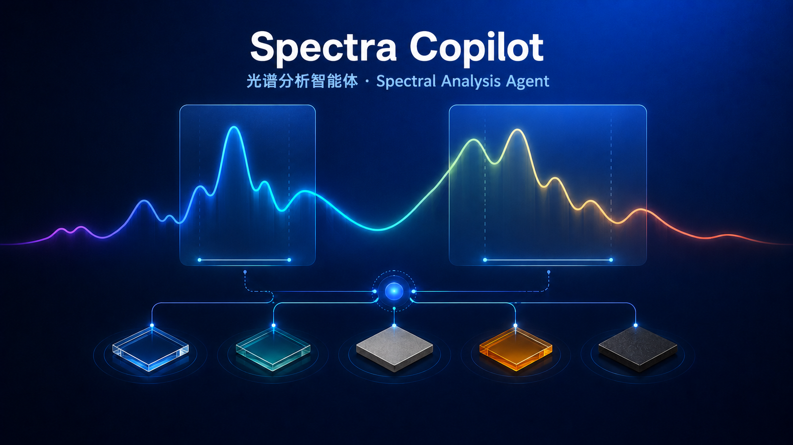

# Spectra Copilot

<p align="right"><a href="README_EN.md">English</a> | <strong>中文</strong></p>

<p align="center">
  
</p>

### 面向材料、光学与热管理研究的可审计光谱分析 Agent

从原始光谱到可解释的材料决策。Spectra Copilot 不是把若干计算按钮包装成聊天框：你提供研究任务和已授权的数据，它会理解目标、补齐必要条件、调用受控的本地计算工具，并交付可复算的图、表、候选排序与 HTML 报告。

> **模型决定下一步做什么；Harness 保证数据、计算与结论都在可验证的边界内。**

<p>
  <a href="https://spectra-copilot.onrender.com/"><strong>在线体验</strong></a> ·
  <a href="#三分钟体验完整-agent-工作流"><strong>三分钟演示</strong></a> ·
  <a href="#agent-architecture"><strong>查看架构</strong></a> ·
  <a href="#本地运行"><strong>本地运行</strong></a>
</p>

> A local, tool-using spectral-analysis Agent for materials, optics, and thermal-management research.

---

## 项目介绍

传统光谱分析往往需要在“找文件、确认单位、填参数、计算、画图、整理报告”之间来回切换。Spectra Copilot 把这些步骤串成一个有边界的研究协作流程：

- 你可以直接说：“比较这批样品在太阳波段与 8–13 μm 的表现，筛出值得继续验证的候选材料，给我一张对比图和一份组会报告。”
- Agent 先读取数据摘要、识别真正缺少的物理条件；不会在未确认单位、波段或温度时静默计算。
- LLM 负责理解任务、组织工具与解释结果；代码负责单位换算、插值、积分、绘图与导出等确定性事实。
- 最终结果会明确区分：**工具事实、限定前提下的工程判断、仍需实验验证的条件**。

它适合做材料筛选与科研展示原型，也适合用来讨论一个严肃的 Agent 系统如何把自然语言能力与受控计算结合起来。

## 三分钟体验完整 Agent 工作流

### 在线演示

访问 [Spectra Copilot 在线演示](https://spectra-copilot.onrender.com/)，无需安装：

1. 点击 **“载入候选光谱”**，界面只显示 5 份可逐个移除的公开演示数据；此时不会自动发送任务。
2. 点击 **“查看推荐任务”**，可以修改研究目标和条件。
3. 点击 **“生成筛选报告”**，观察 Agent 的条件确认、工具轨迹、加权计算、对比图和报告交付。
4. 在右侧预览中打开谱图或报告；可继续告诉 Agent 如何修改，系统会保留已有版本。

当前在线版的引导演示仅针对内置样例提供受控额度；如果上传自己的数据，请在 **AI 设置** 中使用自己的 DeepSeek 或 OpenAI 兼容服务 Key。公共网页不会扫描访问者电脑，上传数据与交付物只在运行内存中短暂保存。

### 你会看到什么

| 阶段 | Agent 做什么 | 你能复核什么 |
| --- | --- | --- |
| 数据接收 | 读取文件摘要，检查列、单位候选、数据范围和覆盖波段 | 已授权的文件范围、待确认条件 |
| 条件建立 | 合并“这是反射率”“3–5 μm”“300 K”等对话信息 | 计算前提与未解决问题 |
| 工具编排 | 选择摘要、审计、加权、作图、报告等最小必要工具 | 实时工具轨迹与结果摘要 |
| 决策交付 | 排序候选材料，生成真实数据绘制的图与报告 | 指标、图表、限制条件、下一步建议 |

## 它能解决哪些问题

| 研究任务 | Agent 的工作方式 | 主要交付物 |
| --- | --- | --- |
| **辐射制冷候选筛选** | 检查太阳波段与大气窗口覆盖；在确认数据含义后计算 ASTM G173 或黑体加权指标 | 加权指标、候选排序、谱图与验证前提 |
| **红外辐射特征 / 隐身候选比较** | 提取指定波段的峰谷、均值与趋势；审查反射率是否能在不透明或已知透射率条件下推断发射率 | 波段特征表、同图对比、带假设的工程解释 |
| **光学涂层与材料选型** | 比较多样品的公共波段、单位和 Y 值含义，阻止不可比数据被直接排名 | 可比性检查、筛选依据、真实多曲线图 |
| **仪器数据接收与排错** | 判断分隔符、表头、无效行、重复波长、异常值与候选单位；必要时审计原始行 | 数据质量摘要、异常位置与待确认事项 |
| **组会 / 答辩 / 论文式汇报** | 先收集工具事实，再生成包含真实谱图、方法、结果、AI 解释和限制的 HTML | 可在浏览器打印为 PDF 的分析报告 |
| **下一步实验设计** | 根据已有覆盖范围与计算结果提出补测波段、温度或对照实验建议 | 有证据边界的实验建议，而非虚构机理结论 |

<a id="agent-architecture"></a>

## 为什么它是 Agent，而不只是计算器

Spectra Copilot 将“规划”和“事实计算”明确分层：

| 层 | 当前职责 | 明确不做什么 |
| --- | --- | --- |
| **LLM 研究协作层** | 理解自然语言任务、合并上下文、选择工具、提出必要追问、解释结果、组织报告 | 不心算积分，不凭图像或记忆编造数值 |
| **Agent Harness** | 意图路由、会话记忆、权限检查、条件闸门、工具调用循环、执行轨迹、交付物版本化 | 不允许模型越过授权读取文件或随意重建已有成果 |
| **确定性光谱工具层** | 解析、质检、单位换算、插值、波段特征、ASTM/黑体加权、绘图、报告、导出 | 不修改原始数据，不把研究建议伪装成实验结论 |

核心原则是：**模型负责“该做什么”，代码负责“事实是什么、能不能做”。**

```text
自然语言研究任务 + 已授权光谱文件
                ↓
LLM：理解目标、规划、选择工具、追问与解释
                ↕
Harness：上下文 / 权限 / 条件检查 / 工具轨迹 / 产物版本
                ↕
确定性工具：解析、物理计算、绘图、报告、导出
                ↓
可复算的图、表、候选材料比较、研究建议与报告
```

## 工具箱与能力导航

工具按任务按需调用。普通问答不会无故生成文件或发起物理计算。

| 能力模块 | 当前工具 | 作用 |
| --- | --- | --- |
| 文件理解与授权读取 | `get_selected_spectrum_summaries` | 在授权范围内读取文件摘要、点数、候选单位、范围与提醒 |
| 原始数据审计 | `scan_raw_spectrum_rows` | 按阈值、极值或异常定位最多 30 行原始 X/Y 数据与近似源行号 |
| 语义与上下文记忆 | `update_task_context`、`confirm_spectrum_meanings` | 理解“300 K”“刚才的范围”“这些都是反射率”等条件并写入结构化状态 |
| 专业约定查询 | `get_legacy_demo_contract` | 读取项目内 ASTM、绘图和积分约定，避免模型凭记忆替代方法 |
| 光谱特征分析 | `summarize_band_features` | 计算指定波段均值、极值、极值位置和趋势 |
| 物理加权计算 | `calculate_weighted_metrics` | nm 数据使用 ASTM G173 AM1.5G；μm/波数数据按指定温度进行 Planck 黑体加权与梯形积分 |
| 科学可视化 | `generate_spectrum_chart`、`generate_comparison_chart` | 基于原始点生成单样品或多样品真实谱图与波段标注 |
| 报告与网页交付 | `generate_screening_report`、`generate_analysis_report`、`generate_custom_html_deliverable` | 生成多材料筛选、单样品或自定义 HTML 报告，且报告含真实谱图与工具事实 |
| 可追溯修改 | `read_current_artifact`、`patch_current_html_artifact` | 用 `@交付物` 锁定目标，只创建该交付物的下一版本 |
| 数据导出 | `/api/weighted-export` | 导出已得到的加权结果为 CSV 或 Excel |

完整的意图路由、记忆、工具边界与评测原则见 [ARCHITECTURE.md](ARCHITECTURE.md)。

## 一次任务如何完成

1. **接收数据与任务**：从 Desktop 范围内查找，或主动上传 CSV、TXT、TSV、DPT、XLSX 光谱文件；单次最多 30 份。
2. **建立可信上下文**：检查分隔符、表头、无效行、重复波长、排序、Y 值范围、波段覆盖和候选单位；物理计算前必须确认单位与物理含义。
3. **调用最小必要工具**：优先摘要；确有需要才读取原始行，再做特征分析、加权计算、出图或报告。
4. **Harness 守住边界**：缺少波段、温度或确认信息时暂停并追问；默认最多 6 个模型回合，并为最终答复预留一个回合，避免无限循环和无谓成本。
5. **交付并保留证据**：聊天中显示公开的工具轨迹；图、报告和数据导出都以本机确定性工具结果为基础。修改 `@图` 或 `@报告` 只更新该产物的下一版本。

## 可信性、隐私与边界

- **不让 LLM 心算**：单位换算、插值、ASTM/黑体权重、梯形积分、CSV/Excel 和绘图数据均由确定性代码完成。
- **不静默改数据**：自动单位判断只是候选提示；清洗、换算或物理结论需要相应确认条件。
- **最小化送入模型的数据**：模型通常只见文件名、摘要、确认状态和计算结果；原始行只在用户明确排错时按需提供，最多 30 行。
- **结果与建议分层**：报告区分工具事实、AI 解释、研究建议、限制与待确认项，不能把相关性写成机理证明。
- **失败透明**：模型服务不可用、数据覆盖不足或条件不全时，系统会说明原因、保留可用交付物并支持重试，不伪造成功结果。
- **Key 不进入仓库**：在线版的用户 Key 仅保存在当前浏览器标签页；本地版由本机浏览器存储，直到用户在“AI 设置”中清除。公共演示样例可使用服务端受控额度，但服务端 Key 不会写入 Git、网页 JavaScript 或日志。

这不是医疗、生产安全或法律决策工具。所有科研结论都应由研究者复核原始数据、实验条件和计算假设。

## 本地运行

### 环境要求

- Node.js 20 或更高版本
- macOS、Windows 或 Linux
- 可选：DeepSeek 或其他 OpenAI 兼容服务的 API Key（没有 Key 时，仍可使用本地规则、数据读取和部分确定性能力）

### 命令行启动

```bash
git clone https://github.com/zhongshiyu0129/spectra-workbench.git
cd spectra-workbench
npm install
npm test
npm start
```

打开 <http://127.0.0.1:8787>。

### macOS 快速启动

1. 安装 Node.js 20 或更高版本：<https://nodejs.org/>。
2. 双击 `启动光谱Agent.app`（推荐）；终端显示 `Spectra Copilot 已启动` 后，浏览器打开 <http://127.0.0.1:8787>。
3. 若 macOS 首次拦截未签名 App：点击“完成”，按住 `Control` 点击该 App，选择“打开”，再在确认框中选择“打开”。

<details>
<summary>无法双击启动时：使用终端的备用方式</summary>

1. 在 Finder 打开项目文件夹，在空白处右键，选择“服务”→“新建位于文件夹位置的终端窗口”。
2. 输入 `bash` 后按一次空格，把 `启动光谱Agent.command` 拖进终端；终端会自动填入完整路径。
3. 按回车运行。首次启动会安装依赖，需要保持网络连接。

命令外观类似：

```bash
bash "/完整路径/光谱计算Agent/启动光谱Agent.command"
```

如果 Finder 中没有“新建位于文件夹位置的终端窗口”：先打开“终端”，输入 `cd` 后按空格，再将整个项目文件夹拖进终端并按回车；随后执行第 2 步。
</details>

### Windows 启动

1. 安装 Node.js 20 或更高版本：<https://nodejs.org/>。
2. 双击 `启动光谱Agent-Windows.bat`。
3. 终端显示启动信息后，访问 <http://127.0.0.1:8787>。

## 在线部署

项目已提供 Dockerfile，可部署到 Render、Railway、Fly.io、Google Cloud Run 等平台。

```bash
SPECTRA_MODE=public PORT=10000 npm start
```

公共模式只接受访问者主动上传的文件，不会扫描其电脑；部署前请阅读 [DEPLOYMENT.md](DEPLOYMENT.md)。其中也说明了如何只为内置面试样例配置低额度的服务端 Demo Key，以及为什么绝不能把 Key 写进代码或 README。

## 项目结构

```text
assets/光谱计算器（最终版）.html  # 随项目携带的旧版计算器与 ASTM 数据
server.mjs                        # 本地 HTTP 服务、受控工具与 Agent 循环
src/spectral-core.js              # 可复用、可测试的确定性计算与质检逻辑
src/app.js                        # 浏览器工作台与 Agent 工作流展示
src/styles.css                    # 界面样式与响应式设计
ARCHITECTURE.md                   # Agent 架构、路由、记忆与工具边界
DEPLOYMENT.md                     # 公共演示版部署与额度说明
tests/                            # 自动化测试
启动光谱Agent.app/                # macOS 便利启动器（未签名）
LICENSE                           # MIT 许可证
CONTRIBUTING.md                   # 贡献约定
SECURITY.md                       # 安全边界与报告方式
```

## 开源协作

欢迎以 Issue 和 Pull Request 的方式参与：

- 🐛 **报告 Bug**：请附上可复现步骤、去敏后的数据特征与实际/预期行为。
- 💡 **提出建议**：可讨论新工具、仪器导入格式、物理指标或交互流程。
- 🛠️ **贡献代码**：提交前运行 `npm test`，并避免把 API Key、真实受限实验数据或生成物提交到仓库。
- 🔒 **安全问题**：请按 [SECURITY.md](SECURITY.md) 所述方式报告，而不是公开 Issue。

详细约定见 [CONTRIBUTING.md](CONTRIBUTING.md)。

## 下一阶段

1. 增加“清洗与重采样预览”工具：排序、重复点处理和异常标注必须先由用户确认，再导出新数据。
2. 增加 A/T/R 能量守恒检查、多文件可比性检查、确定性筛选排序以及不确定度分析。
3. 增加论文级多面板图、可复现图表主题配置和重复实验统计。
4. 在公开产品化前补齐用户隔离、任务 checkpoint、队列、可恢复执行和用量审计；之后再考虑 Tauri/Electron 桌面连接器。

## 许可证与第三方内容

本仓库原创代码以 [MIT License](LICENSE) 发布。第三方依赖和随项目携带的旧版资源仍适用各自许可证与声明，详见 [THIRD_PARTY_NOTICES.md](THIRD_PARTY_NOTICES.md)。

---

如果这个项目对你的研究、学习或面试展示有帮助，欢迎 Star、提出建议或分享你的光谱分析工作流。
